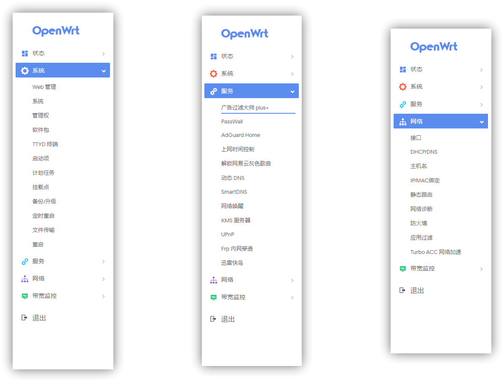

# actions-openwrt-aio

`Github Actions` 是 GitHub 推出的持续集成服务，它提供了配置非常不错的虚拟服务器环境（E5 2vCPU/7G RAM），基于它可以进行构建、测试、打包、部署项目。如觉得项目好，请花1秒钟点亮顶部`⭐star`,分享给更多的朋友.

## 项目介绍

- 本项目直接调用大雕[Lean's OpenWrt](https://github.com/coolsnowwolf/lede)开源仓库源码，保证纯净
- 本项目包含两个版本，一个常用版，一个aio精简版
- 借助`Github Actions`自动生成openwrt固件，感谢大雕[KFERMercer](https://github.com/KFERMercer/OpenWrt-CI)、[P3TERX](https://github.com/P3TERX/Actions-OpenWrt)、[esir](https://github.com/esirplayground/AutoBuild-OpenWrt)
- 定制化编译---必须熟悉整个openwrt编译过程，修改目录下的`x86_64.config` `Build_OP_x86_64.yml`文件即可定制
- 无需搭建编译环境生成.config文件---可选择在线make menuconfig生成配置文件，感谢大雕[P3TERX](https://github.com/P3TERX/debugger-action)
- `fork`此项目后，点击顶部的`star`即可开始编译`openwrt`固件，真正的一键开始编译
- 本项目插件来源的源码仓库：
  - [Lean's OpenWrt](https://github.com/coolsnowwolf/lede)
  - [kenzo](https://github.com/kenzok8/openwrt-packages)
  - [KoolProxyR plus+插件](https://github.com/cnzd/luci-app-koolproxyR)

## 操作步骤

- 如不需要个性化地址，直接在`Actions`标签中下载即可，无需自己编译。

- 注册[GitHub](https://github.com/join)账号

- `Fork`此仓库源码 [GitHub repository](https://github.com/superstarfly/AutoBuild-OpenWrt-Q)

- 定制化固件---编辑`x86_64.config` `Build_OP_x86_64.yml`文件即可定制。

- 开始编译，可在`Actions`标签页进行查看--1）点击顶部`star`即可开始编译；2）也可进入`Build_OP_x86_64.yml`文件取消`push` `branches` `maser`前面`#`开始编译； 3）其他解锁编译由你来发现

- 大功告成，下载固件---进入`Actions`标签页后，选择已完成的`workflows`后，在右方的`Artifacts`即可看到编译生成的固件

- 安装使用openwrt系统---下载解压压缩包后，Openwrt_x86_64固件位于`targets\x86\64`下，选择`openwrt-x86-64-combined-squashfs.img.gz`固件,可直接在openwrt页面进行升级，建议不保留配置，防止出现未知情况（前提已安装过openwrt系统）;全新安装openwrt系统请google

- 生成最新ipk---下载解压压缩包后，编译生成的最新ipk文件位于`packages\x86_64`目录下，请自寻查找

- OpenWrt默认lan IP： `192.168.1.1`, 用户名 `root`，密码 `password`

## 固件包含的常用插件

- 适合 All In One 机器，插件精简，没有乱七八糟的功能。

- 主要功能： `Passwall` `Adguard Home` `KoolProxyR plus+` `解锁网易云灰色歌曲` `动态DNS` `Frp内网穿透` `Kms服务器`

### aio 包含插件

### 常用版包含插件

规划中

## 参考

https://github.com/Lancenas/actions-openwrt-helloworld

https://github.com/superstarfly/AutoBuild-OpenWrt-Q